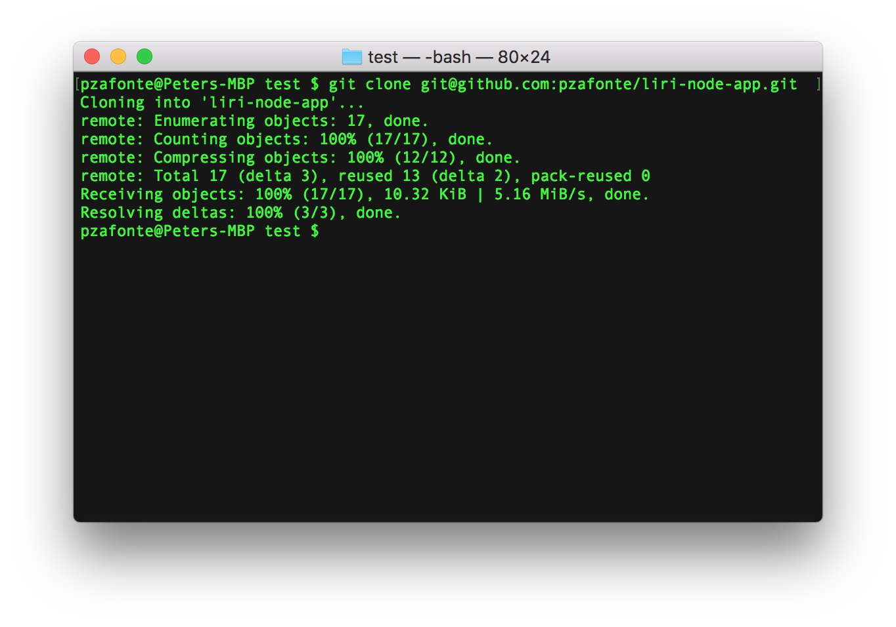
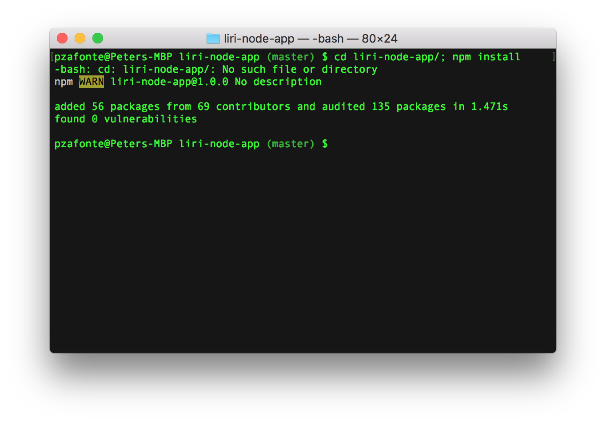
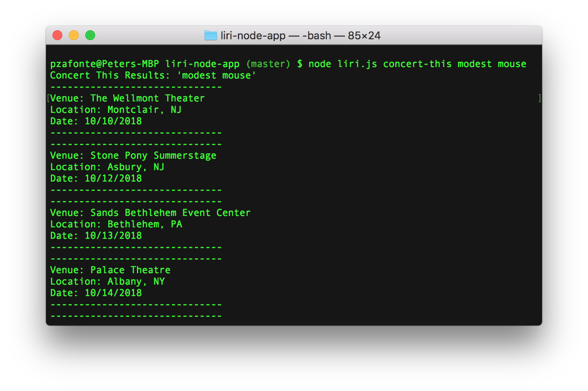
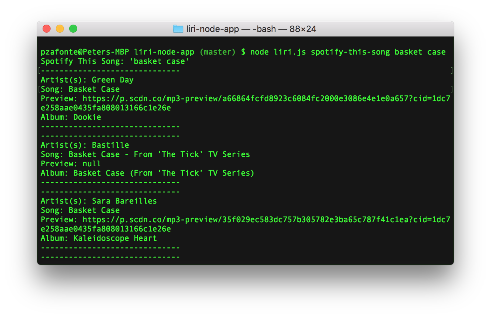
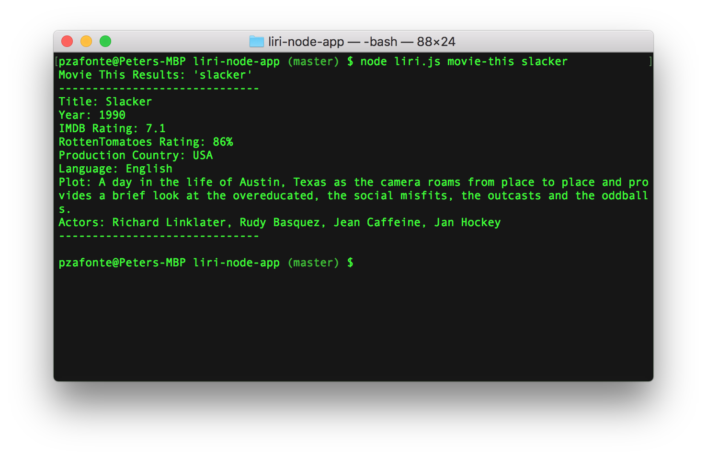
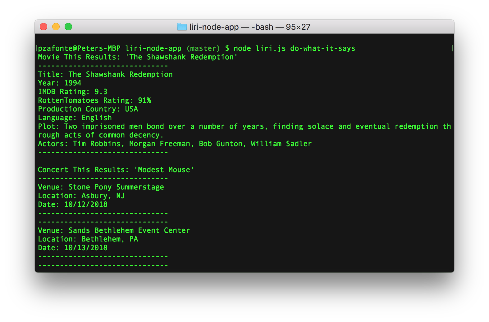

# liri-node-app
LIRI (Language Interpretation and Recognition Interface) understands your commands and performs useful tasks like SIRI.


## Technologies Used
- [x] ES6, Node


## How to Run
To run LIRI, you will need [Bash](https://git-scm.com/), [Node](https://nodejs.org/), and [npm](https://www.npmjs.com/).

1. In Bash, type `git clone git@github.com:pzafonte/liri-node-app.git` to download LIRI.



2. Then, type `cd liri-node-app; npm install` to download the required packages.



3. Next, create a file named `.env`, add the following to it, replacing the values with your Spotify API keys (no quotes) once you have them:

```js
# Spotify API keys

SPOTIFY_ID=your-spotify-id
SPOTIFY_SECRET=your-spotify-secret

```


## Demos - Concert This

Type `node liri.js concert-this <artist/band name here>` to get upcoming concert venues.




## Demos - Spotify This Song

Type `node liri.js spotify-this-song '<song name here>'` to find song information.




## Demos - Movie This

Type `node liri.js movie-this '<movie name here>'` to find movie information.




## Demos - Do What It Says

Type `node liri.js do-what-it-says` to run the commands in `random.txt` file.
